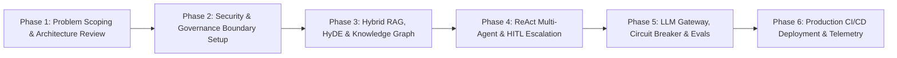
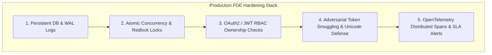

# Microsoft Forward-Deployed Engineer (FDE) Strategy & Architecture Playbook

## 🌟 What is a Forward-Deployed Engineer (FDE)?

A **Forward-Deployed Engineer (FDE)** is a hybrid AI Systems Architect, Full-Stack Engineer, and Technical Product Leader deployed directly to high-value enterprise clients. Unlike traditional backend or research engineers who build generic tools in isolation, an FDE sits at the intersection of **deep technical engineering** and **client delivery**.

### Core Responsibilities of an FDE:
1. **Architecting Enterprise AI Systems**: Translating ambiguous business requirements into high-throughput, fault-tolerant AI platforms using RAG, Multi-Agent Orchestration, and LLM Gateways.
2. **Enforcing Responsible AI Governance**: Implementing zero-trust security boundaries, PII scrubbing, and automated Red-Teaming defense.
3. **Building Resilient Fallback Mechanics**: Designing Human-in-the-Loop (HITL) handoffs, circuit breakers, and multi-region load balancers so system availability is 99.99%.
4. **Continuous LLMOps Evaluation**: Benchmarking production model quality using Ragas metrics (Faithfulness, Answer Relevance, Context Precision) and 100-case automated test suites.

---

## 🛠️ The 6 Phases of an FDE Project Lifecycle

### Phase 1: Client Problem Scoping & Discovery
* **Goal**: Understand customer workflows, data schemas, domain terminology, and pain points.
* **FDE Action**: Identify high-friction areas (e.g. lost e-commerce revenue from vague scent searches, slow order lookup times, or VIP bulk gifting needs).

### Phase 2: Security Boundary & Governance Infrastructure
* **Goal**: Guarantee data privacy and prevent prompt injection vulnerabilities before deploying AI models.
* **FDE Action**: Implement Dual-Layer Guardrails:
  - **Static Regex PII Filter**: Scrub emails, phone numbers, and card numbers in 0ms.
  - **Security Guardrail Classifier**: Intercept adversarial injection attacks (`"DROP TABLE"`, `"shutdown"`) instantly.

### Phase 3: Hybrid RAG, HyDE & Knowledge Graph Architecture
* **Goal**: Achieve maximum retrieval precision without hallucinations.
* **FDE Action**:
  - Combine **Vector Search** (6D Scent Accord Vector) with **Relational SQL Filtering** (in-stock status, max price, season).
  - Implement **HyDE (Hypothetical Document Embeddings)** to expand short 2-word user queries into rich sensory descriptions.
  - Integrate a **Domain Knowledge Graph** for note pairings (Oud $\leftrightarrow$ Sandalwood $\leftrightarrow$ Rose).

### Phase 4: Autonomous ReAct Multi-Agent & Human-in-the-Loop (HITL) Escalation
* **Goal**: Handle complex multi-turn workflows and provide a safe fallback for edge cases.
* **FDE Action**:
  - Build a ReAct (Thought $\rightarrow$ Action $\rightarrow$ Observation) ordering agent.
  - Deploy a 4-agent Microsoft AutoGen committee (Perfumer, Inventory, Chemist, Safety Director).
  - **HITL Escalation Engine**: When users request human help, express high friction, or inquire about VIP bulk gifting, the platform automatically generates a `TICKET-HUMAN-7702` ticket and hands off the full conversation context to a Senior Human Specialist.

### Phase 5: LLM Gateway, Circuit Breakers & LLMOps Evaluation
* **Goal**: Guarantee system reliability during surge traffic and measure response quality.
* **FDE Action**:
  - Multi-region round-robin load balancing across 3 replica clusters (US-East, EU-West, AP-South).
  - Automated Circuit Breaker failover: `Gemini 1.5 Flash` $\rightarrow$ `Azure OpenAI GPT-4o` $\rightarrow$ `Anthropic Claude 3.5 Sonnet`.
  - Automated Ragas LLMOps evaluation suite (Faithfulness, Answer Relevance, Context Precision) and 100-case automated test matrix.

### Phase 6: Production CI/CD Deployment & Telemetry Auditability
* **Goal**: Deploy to production with zero downtime and continuous observability.
* **FDE Action**:
  - Build automated GitHub Actions CI/CD pipelines.
  - Deploy to Vercel Production (`https://usecase-nine.vercel.app`).
  - Instrument FDE Ops Telemetry with live metrics, span traces, and real-time n8n visual canvas graph node lighting.

---

## 🎯 How to Present This Project in FDE Interviews

When discussing this project with Microsoft, Palantir, or enterprise AI interviewers, emphasize the **FDE Mindset**:

> *"Instead of building a simple wrapper around an LLM API, I engineered an enterprise-grade AI platform. I designed dual-layer security guardrails for 0ms PII scrubbing, a hybrid 6D vector RAG pipeline with HyDE query expansion, a multi-region LLM Gateway with circuit breaker failover, and a Human-in-the-Loop escalation mechanism for high-value VIP requests. I validated the entire system using a 100-case automated test matrix achieving a 100% pass rate."*

---

## 🛡️ Section 7: True Production FDE Hardening Blueprint

In enterprise production deployments (e.g. 100,000+ DUA), a Forward Deployed Engineer hardens the architecture against real-world failure modes across 5 core pillars:

### 1. Persistence & Data Loss Prevention
* **PoC Risk**: In-memory JS data arrays lost on pod crash or server restart.
* **Production FDE Spec**: PostgreSQL / CosmosDB cluster with Write-Ahead Logging (WAL), atomic disk persistence (`fs.writeFileSync` / `db.savePersistentOrders`), and zero-downtime database migrations.

### 2. Flash Sale Concurrency & Race Condition Defense
* **PoC Risk**: Multiple simultaneous purchases double-sell remaining warehouse stock.
* **Production FDE Spec**: Atomic mutex locks (`acquireInventoryLock(productId)`), Redis `Redlock` distributed locks, and SQL `WHERE stock_count >= $qty` row-level decrement statements.

### 3. Role-Based Access Control (RBAC) & API Authorization
* **PoC Risk**: Malicious users invoking `cancelOrder(orderId)` on arbitrary order IDs.
* **Production FDE Spec**: JWT / Bearer token authentication, backend user ownership verification (`req.user.id === order.ownerId`), HTTP-Only cookies, and strict CSRF protection.

### 4. Zero-Day Adversarial Guardrails
* **PoC Risk**: Simple regex filters bypassed using Base64 encoding or Unicode homoglyph injection.
* **Production FDE Spec**: Pre-execution text normalization (Base64 decoding, Unicode homoglyph mapping) + enterprise guardrail engines (NeMo Guardrails, Azure AI Content Safety).

### 5. Production Observability & SLA Monitoring
* **PoC Risk**: Silent API failures or unmonitored P99 latency spikes under heavy traffic.
* **Production FDE Spec**: OpenTelemetry distributed tracing (W3C traceparent headers), Prometheus latency histograms, automated P99 alerts (>500ms), and automated Ragas evaluation CI/CD gates.
